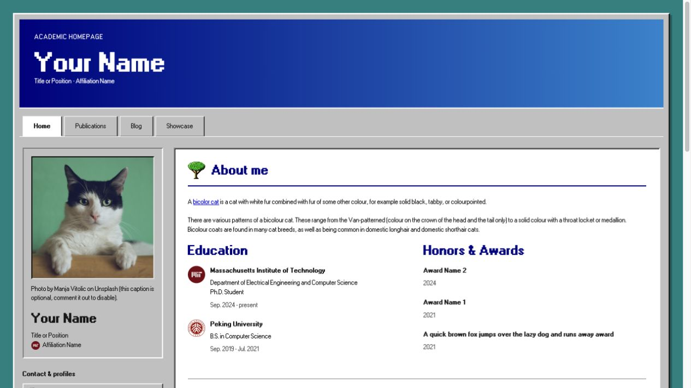
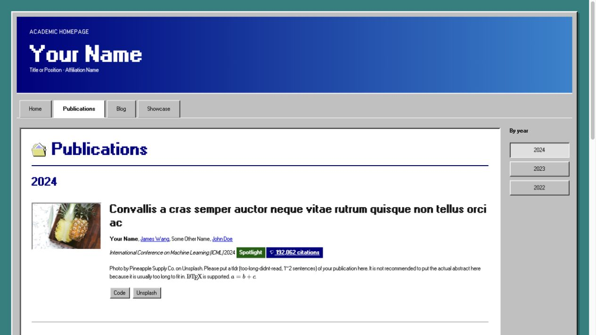

# academic-homepage — Nostalgia 1990s

A late-1990s desktop-inspired variant of [academic-homepage](https://github.com/luost26/academic-homepage), a GitHub Pages (Jekyll) template for personal academic websites. It pairs the original template's profiles, publications, blog, and Showcase with Windows 95/98-style silver bevels, classic icons, and pixel-grid typography.

[Live demo](https://luost26.github.io/academic-homepage-nostalgia-1990s/) · [Main repository](https://github.com/luost26/academic-homepage)

[](https://github.com/luost26/academic-homepage-nostalgia-1990s/actions/workflows/pages/pages-build-deployment)
[](https://hits.sh/github.com/luost26/academic-homepage-nostalgia-1990s/)
[](https://github.com/luost26/academic-homepage-nostalgia-1990s)
[](https://github.com/luost26/academic-homepage-nostalgia-1990s/forks)

## Screenshots

### Homepage

[](https://luost26.github.io/academic-homepage-nostalgia-1990s/)

### Publications

[](https://luost26.github.io/academic-homepage-nostalgia-1990s/publications)

## Nostalgia 1990s theme

This version uses a cohesive academic desktop-companion design: a teal backdrop, silver beveled frame, navy-to-blue identity masthead, attached navigation tabs, and inset white reading surfaces. Native-size Windows 98 icons and locally hosted pixel-grid fonts create the nostalgic feel without fake window controls, menus, or a taskbar.

Personalize the same YAML files in `_data/` and Markdown collections as before. The homepage, publication and blog archives, blog articles, Showcase, and the error page share `_layouts/default.html` and the same 1280px maximum frame width. This variant has one homepage layout.

- Change the classic palette, spacing, borders, and typography through the CSS variables and theme rules in `assets/css/global.css`. `--classic-text-size` keeps reading text and button labels consistent at 11px.
- Blog reading styles and the contents sidebar are in `assets/css/blog.css`.
- Shared theme helpers are in `_includes/classic/`. Navigation entries remain in `_data/navigation.yml`.
- Section headings use genuine 32×32 PNG icons from `assets/images/classic/icons/32/`; Contact & profiles use genuine 16×16 variants from `assets/images/classic/icons/16/`. Both sizes are displayed one-to-one, without downscaling. About me uses the tree icon.
- Publication images and generated bubble covers share a recessed bevel. Missing covers use deterministic, title-seeded, dithered bubble visual hashes in `assets/js/bubble_visual_hash.js`; publication-entry link buttons use compact 24px desktop heights.
- The header scrolls with the page, and section links use native browser navigation. Active year links are handled by `assets/js/classic.js`. The theme includes visible keyboard focus, larger touch targets, reduced-motion styles, and print styles.
- Artwork credits are collapsed by default in the footer. Icon provenance is recorded in [the icon manifest](assets/images/classic/manifest.json), and font sources and licenses are bundled in [the font kit](assets/fonts/classic/NOTICE.md). Design research and implementation evidence are in [the design notes](_design/nostalgia-1990s/IMPLEMENTATION.md); `_design/` and `scripts/` are excluded from the website.

Run `bundle exec jekyll serve` to preview the theme locally, then open the displayed URL with the configured `/academic-homepage-nostalgia-1990s/` subpath. Build and verify with `bundle exec jekyll build`, `python3 scripts/verify_classic.py _site`, and `node scripts/test_visual_hash.js`. Keep the artwork credits and license/source links when reusing the downloaded assets.

## Acknowledgements

The Nostalgia 1990s theme uses artwork and typography from the following creators and projects:

- [Windows 98 Icon Viewer](https://win98icons.alexmeub.com/), hosted by Alex Meub — the user-selected classic icon collection. The native 16×16 and 32×32 PNG variants were extracted unchanged from the collection's official archive. No explicit artwork reuse license was found on the viewer page; no open-source icon license is claimed. See [the icon provenance notice](assets/images/classic/NOTICE.md) and [manifest](assets/images/classic/manifest.json).
- MS Sans Serif pixel-grid reconstructions by lou — [regular](https://fontstruct.com/fontstructions/show/1384746) and [bold](https://fontstruct.com/fontstructions/show/1384862), distributed unmodified under [CC BY-SA 3.0](https://creativecommons.org/licenses/by-sa/3.0/). The WOFF2 files were obtained from [98.css](https://github.com/jdan/98.css); they are reconstructions, not original Microsoft font binaries. See the [font notice](assets/fonts/classic/NOTICE.md) and bundled [regular](assets/fonts/classic/font-regular-license.txt) / [bold](assets/fonts/classic/font-bold-license.txt) license notices.

Original template content and image credits are retained. The bubble visual hash keeps the original MD5 implementation credits to Paul Johnston and Greg Holt in its source. Historical references and unused research assets have their own source records in [the research resource guide](_design/nostalgia-1990s/RESOURCES.md). Keep these credits and the bundled license/source files when reusing the assets.

## Need Help?

If you run into **any** issues while using this template, or have suggestions for improvements, please don't hesitate to create an issue [here](https://github.com/luost26/academic-homepage/issues/new).

### FAQs

- [Need blogging feature?](https://github.com/luost26/academic-homepage/issues/13#issuecomment-2646371324)
- [How to show citation count for papers?](https://github.com/luost26/academic-homepage/issues/29#issuecomment-3222496187)


## Getting Started

1. First, click the "Use this template" button to create a new repository. The name of the repository should be `<your-github-username>.github.io` (click [here](https://docs.github.com/en/pages/getting-started-with-github-pages/about-github-pages#types-of-github-pages-sites) to learn more about naming a GitHub Pages repository).

### Running Locally (Debug & Preview)

2. Follow the **step 1** and **step 2** of the instruction [here](https://jekyllrb.com/docs/) to install prerequisites and jekyll.

3. Clone your forked repository to your local machine.

4. Run the following command in the root directory of the repository:

   ```bash
   bundle exec jekyll serve
   ```

5. Browse to the displayed URL to see the website.


### Deploying to GitHub Pages

2. Go to the repository settings and enable GitHub Pages. Detailed instructions can be found [here](https://docs.github.com/en/pages/getting-started-with-github-pages/creating-a-github-pages-site#creating-your-site).

3. Navigate to your created website, and follow the instructions displayed on the homepage (if any) to finalize the setup.
